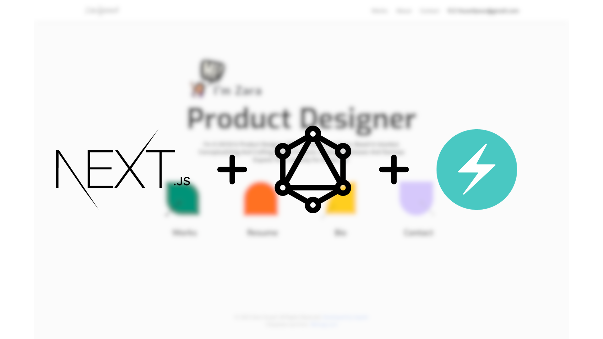

# Dynamic Design Portfolio

[](https://www.zarayousef.com/)

## Description

A personal portfolio website uniquely crafted using Next.js and Chakra UI, enhanced with GraphQL. This portfolio distinctively showcases my development expertise, highlighting an array of projects and experiences in web development.

## Table of Contents

- [Dynamic Design Portfolio](#dynamic-design-portfolio)
  - [Description](#description)
  - [Table of Contents](#table-of-contents)
  - [Installation](#installation)
  - [Usage](#usage)
  - [Documentation](#documentation)
  - [License](#license)
  - [Contact](#contact)

## Installation

To run this project locally, follow these steps:

1. Clone the repository:

```bash
 git clone https://github.com/septan4/dynamic-design-portfolio.git
```

2. Install dependencies:

```bash
cd neumorphisem-portfolio
npm install
```

3. Start the development server:

```bash
npm run dev
```

## Usage

Visit the live portfolio website [here](https://zarayousef.com) to explore my projects.

## Documentation

For detailed information on the project structure, component usage, and customization options, please refer to the [Documentation](./README.md).

## License

This project is licensed under the [MIT License](LICENSE).

## Contact

Feel free to reach out to me via email at [sepehr75t@gmail.com](mailto:sepehr75tl@gmail.com) or on [LinkedIn](https://www.linkedin.com/in/sepehrtanhaei/).

[](https://github.com/septan4/dynamic-design-portfolio/stargazers)
[](https://github.com/septan4/dynamic-design-portfolio/network)
[](https://github.com/septan4/dynamic-design-portfolio/issues)
